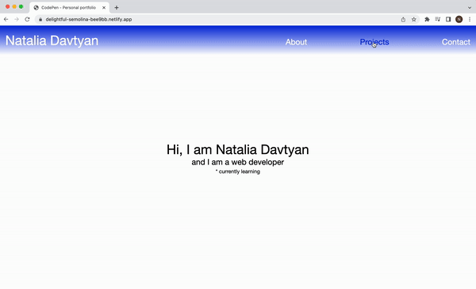

# Personal portfolio

My first personal portfolio as a web developer.

## Features
This is a one-page portfolio and the menu can be used to jump to the desired section (About, Projects and Contact). Users can click on the projects or my contact info and they will be redirected to a new page.

## Demo

Test it on Netlify: https://delightful-semolina-bee9bb.netlify.app/

## Technologies
The project is built using:
* HTML
* CSS

## Technical details
* Created my own design.
* Made the website responsive by using the relative units and media queries.
* The menu is used to navigate to different sections of the page.

## Project status
The project is complete.

## Acknowledgements
Personal portfolio is a solo project that was part of [the Responsive Web Design Certification at freeCodeCamp](https://www.freecodecamp.org/learn/2022/responsive-web-design/).

## Contact
Created by [Natalia Davtyan](https://github.com/nataliadavtyan)
